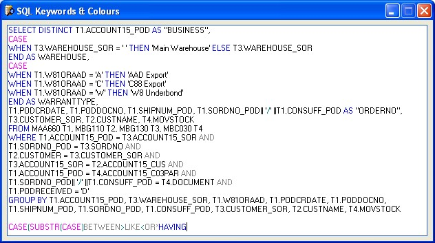



## UPDATED SQL Keywords &amp; Operators

### Description

SQL Keywords &amp; Operators Colour Syntax v2.0

This application has been updated from my previous version. It has resolved several minor bugs and now runs faster and better than before.

This is the first Open Source SQL Analyser that mimics SQL Query Analyser. It is completely updatable and currently has 176 Keywords and 10 Operators.

A must have code addition to your Query Analysers. If you like this application don't forget to vote!!! It is nice to be appreciated!
 
### More Info
 

             |
---                |---
**Submitted On**   |2005-12-06 18:17:56
**By**             |[Xander75](https://github.com/Planet-Source-Code/PSCIndex/blob/master/ByAuthor/xander75.md)
**Level**          |Advanced
**User Rating**    |4.0 (8 globes from 2 users)
**Compatibility**  |VB 6\.0
**Category**       |[String Manipulation](https://github.com/Planet-Source-Code/PSCIndex/blob/master/ByCategory/string-manipulation__1-5.md)
**World**          |[Visual Basic](https://github.com/Planet-Source-Code/PSCIndex/blob/master/ByWorld/visual-basic.md)
**Archive File**   |[UPDATED\_SQ19570312162005\.zip](https://github.com/Planet-Source-Code/xander75-updated-sql-keywords-amp-operators__1-63546/archive/master.zip)

